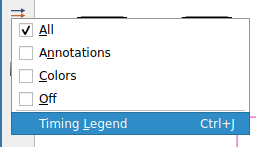
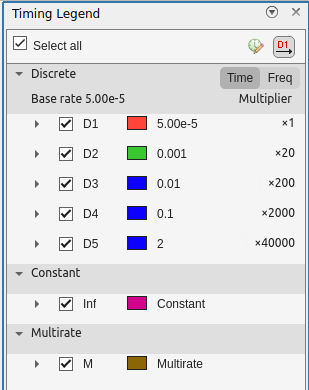
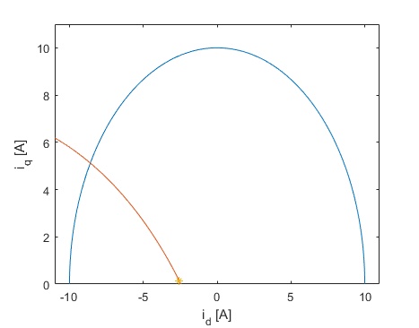

# MATLAB dsPIC33CK LVMC board - FOC with field-weakening control tutorial

[YouTube Demo](https://youtu.be/GdLg5sm1Nhc?si=Hxxs8GoJx17beA3V)

## 1. Introduction

This document describes the setup requirement for running the proposed Vector Control with field-weakening technique taking into consideration voltage and current saturations and  using space vector modulation. The examples are design using fixed point data type, taking care to limit calculation time. In this examples, we used 2 different motors where each simulink file is specific to a given motor. 

## 2. SUGGESTED DEMONSTRATION REQUIREMENTS

### 2.1 MATLAB Model Required for the Demonstration

- MATLAB model can be cloned or downloaded as zip file from the Github repository ([link](https://github.com/rdelpoux/ctrl-elec/tree/main/MCU/vectorControl)).

### 2.2 Software Tools Used for Testing the MATLAB/Simulink Model

- [MPLAB X IDE and IPE (v6.00)](https://www.microchip.com/en-us/tools-resources/develop/mplab-x-ide) and [XC16 compiler (v2.00)](https://www.microchip.com/en-us/tools-resources/develop/mplab-xc-compilers)

 

- [Matlab R2023a](https://fr.mathworks.com/) and [Mplab Device Block for Simulink (v3.50.34b)](https://fr.mathworks.com/matlabcentral/fileexchange/71892-mplab-device-blocks-for-simulink-dspic-pic32-and-sam-mcu)

- Required MATLAB add-on packages
  - Simulink (v10.7)
  - Simulink Coder (v9.8)
  - MATLAB Coder (v5.5)
  - Embedded Coder (v7.9)
  - Fixed-Point Designer (v7.6)

> **_NOTE:_**
> The software used for testing the model during release is listed above. It is recommended to use the version listed above or later versions for building the model.

### 2.3 Hardware Requirements

The demonstration uses a [dsPIC33CK LVMC](https://www.microchip.com/en-us/development-tool/dm330031) board

The example can be used with different motors, including

- [Teknic-2310P motor](https://www.digikey.fr/fr/products/detail/texas-instruments/LVSERVOMTR/5005342)

- [Hurst Long - AC300022 - with encoder](https://fr.farnell.com/en-FR/microchip/ac300022/bldc-motor-3-phase-w-encoder/dp/1688718)

## 3. Hardware Setup

This section describes hardware setup required for the demonstration.

- Connect the 3-phase wires from the motor to PHA, PHB, and PHC of the J14 connector, provided on the LVMC Board. For both motors:

  

  | PHA   | PHB  | PHC   |
  | ----- | ---- | ----- |
  | White | Red  | Black |

- Connect the encoder wires to +5V, GND, QEA, QEB and QEI of the J8 connector, provided on the from LVMC Board. For both motors:

  - For Teknic-2310P motor:

  

  | +5V  | +3.3V | DGND  | QEA  | QEB    | INDX  |
  | ---- | ----- | ----- | ---- | ------ | ----- |
  | Red  | NC    | Black | Blue | Orange | Brown |

  - For Hurst Long - AC300022

  

| +5V  | +3.3V | DGND  | QEA   | QEB  | INDX |
| ---- | ----- | ----- | ----- | ---- | ---- |
| Red  | NC    | Black | White | Blue | NC   |

- Plug a 24V power supply to **connector J1** on the LVMC Board. Alternatively, the Inverter Board can also be powered through connector J2.
- The board has an onboard programmer **PICkit™ On Board (PKoBv4)** , which can be used for programming or debugging the microcontroller or dsPIC DSC on the Board. To use the onboard programmer, connect a  micro-USB cable between the Host PC and **connector J13** on the LVMC Board.

  

## 4. BASIC DEMONSTRATION

Follow the below instructions step-by-step, to set up and run the motor control demo:

1. The model do not require any additional external file such as mfile to run.

2. Open the MCU_vectorControl_dsPIC33CK_LVMC_FW_Hurst.slx or MCU_vectorControl_dsPIC33CK_LVMC_FW_TI.slx Simulink model

   

3. This opens the FOC flux weakening Simulink model as shown below.

   

4. Define the motor used:

   - The model provides a mask which allows to define the motor choice and compute the control gains with respect to the motor choice.

      

   - Double click on the bloc to open the dialogue window:

      - For motor choice, predefined motor have been registered, to use another motor, select Custom and enter the parameter directly:

      

      - For the selected motor, the gain tunning is updated. The damping factor and the time response can be adjusted. (see [FOC control page](https://ctrl-elec.fr/mcu_electric_motor_field_oriented_control_controller.html) for tunning details).

      

5. Click on the double wire icon to highlight timing legend 

   

6. From this Simulink model an MPLAB X project can be  generated, and it can be used to run the PMSM motor using LVMCr Board. 

   To generate the code from the Simulink model, go to the **"MICROCHIP"** tab, and enable the tabs shown in the figure below.

   

7. To generate the code and run the motor, click on **‘Build Model’ or ‘Clean Build Model’** option under the **“Microchip”** tab. This will generate the MPLAB X project from the Simulink model and program the dsPIC33CK256MP508 device.

     

8. After completing the process, the **‘Operation Succeeded’** message will be displayed on the **‘Diagnostics Viewer’**.

9. If the device is successfully programmed, **LED- LD10** will be blinking.

   

10. Keep the potentiometer (**POT1**) position at the left. Then, to start the demo, press the push button **SW1**. Wait 1s, an alignement strategy find the encoder initial position for the case where no index is present. 

11. In this mode, the motor is enabled to run clockwise in voltage mode. The reference voltage is set by the potentiometer **POT1**. To run in anticlockwise direction press **SW3**

12. To activate the velocity control with the flux-weakening option, press the button SW2. In this mode, potentiometer **POT1** sets the reference speed. 

## 5. DATA VISUALIZATION USING PICGUI

The proposed algorithm comes with the possibility to vizualize data using PICGUI interface. More details on this section is available on the [Motor Control University - Data Visualization page](https://ctrl-elec.fr/mcu_electric_motor_embeddedCode_datavisu.html). [MPLAB Device Blocks for Simulink](https://www.mathworks.com/matlabcentral/fileexchange/71892) provide a simple but powerful graphical user interface. It allows to send and receive data from the chip using a Serial link.

1. Connection to the PC

   Although the board has ports to connect a serial link (USB, RS232), in this example we are using an special [FTDI cable](https://www.ftdichip.com/Support/Documents/DataSheets/Cables/DS_C232HD_UART_CABLE.pdf). The USB 2.0 Hi-Speed to UART cable incorporates FTDI’s FT232H USB to UART interface IC device which handles all the USB signalling and protocols.  The cable provides a fast, simple way to connect devices with 3.3 volt digital interfaces to USB. 
   [FTDI cable Driver](https://www.ftdichip.com/Drivers/VCP.htm)

   ### 

   - The TX pin (orange pin 2) must be connected RX pin (mikroBUS A) of the LVMC Board.
   - The RX pin (yellow pin 3) must be connected TX pin (mikroBUS A) of the LVMC Board.
   - Do not forget to connect the GND (black pin 10) to the LVMC board.

   The pin connection is represented below:

   ### 

2. On the computer side, once the code has been program on the chip. The **PicGui** interface allows the data visualization. **PicGui** is directly accessible from the microchip banner:

   

3. It opens the following window:

   

   4. Select the correct port, and the correct baudrate 921 600 bauds in this example. Then click on **Connexion**.

   5. To visualize the data, click on button **Start**.

   6. For better data visualization, download the mfile *DataVisu.m* from Github repository ([link](https://github.com/rdelpoux/ctrl-elec/tree/main/MCU/vectorControl)) and enter the DataVisu in thepicgui central windows. 

      Results should looks like on the figure below:

    
   
      The window highlight the mode (Voltage/Speed), the measured DC voltage, The Max Voltage according to the chosen SVM and the CPU load.

## 6. REFERENCES:

For more information, refer to the following documents or links :

- The FOC algorithm proposed in the exemple is detailled on the [ctrl+elec website](https://www.ctrl-elec.fr)
  - [Motor Control University - Field Oriented Control (FOC)](mcu_electric_motor_field_oriented_control_FOC.html)
  - [Motor Control University - Embedded code implementation](https://ctrl-elec.fr/mcu_electric_motor_embeddedCode_intro.html)
- Videos about the example can be found on the youTube channel [@ctrl_elec](https://www.youtube.com/@ctrl_elec)
  - [MCU - Vector Control - Getting Started](https://youtu.be/fAhIvsgS1aM?si=tAoGpcwJagEB3y5x)
- This Tutorial was inspired by Microchip MPLAB DISCOVER Example :
  - [MATLAB-Simulink model for Sensorless FOC control using Sliding mode observer (SMO)](https://mplab-discover.microchip.com/v2/item/com.microchip.code.examples/com.microchip.matlab.project/com.microchip.subcategories.motor-control-and-drive/com.microchip.matlab.project.matlab-mclv-48v-300w-dspic33ck64mc105-foc-smo/1.0.0?view=about)
